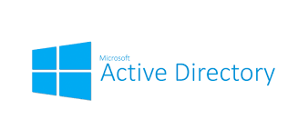

<h1>Active Directory Deployed in the Cloud With Azure</h1>
This tutorial outlines the use of Azure Virtual Machines to implement on-premises Active Directory.

<h2>Environments and Technologies Used</h2>

- Microsoft Azure (Virtual Machines/Compute)
- Remote Desktop Connection
- Active Directory Domain Services
- Powershell

<h2>Operating Systems Used </h2>

- Windows 10</b> (21H2)
- Windows Server 2022

<h2>Deployment and Configuration</h2>

- Login to your Microsoft Azure (free tier) account and make sure that you are at the main dashboard. In the "Azure Services" section click on "resource group" and you will see the window to create a resource group. click on the "create" button to create a resource group.
 
In the "resource group name ensure that it is something that you can remember. In the "resource details" section place the instance in a region that will be close to your fictional customers. After selecting your region you can click "review and create" then "create". When Azure is done creating the resource group you can go back to the "resource group" page and it will be there.

- Go back into the search bar and type "virtual networks" to reach the virtual networks page. Click on create to create the virtual network. On the next screen in the "instance details" section make sure that the region of the v-net matches the region of your resource group.

<h2> MAKE SURE THAT THE REGION THAT YOUR VNET IS LOCATED IN MATCHES THE SAME REGION AS THE RESOURCE GROUP </h2>

- We will now create the virtual machine that will be the domain controller. Go to the search bar and type in virtual machines to go to the VM page. Once there click on the "create" button. Then you will choose "azure virtual machine". This will bring you to the page where you will create the VM instance.
 
The main things to worry about here is that the VM instance is in the same region as your resource group. For the image of the virtual machine you want to pick "Windows Server 2022" For the "admin account" section here you will create the credentials to log onto your virtual machine server. Click the next button until you reach to the "networking" tab and check that Azure has created the Vnet to match the machine. Click the "review and create" then "create" again to create the virtual machine server.

The virtual machine and the Vnet was created 
 

- Now to create the "client virtual machine" by going to the search bar and typing in virtual machines. When you create this virtual machine, make sure that you use an image of "windows 10" for the virtual machine. Do not forget to check the "licensing box" at the bottom of the screen before you proceed.

When you are finished you can go back to the "virtual machines" screen and see that the "client" virtual machine was created.

- Through this tutorial you have created two virtual machines that has a virtual newtwork attached to them. You can now login to anyone one of the virtual machines and do some testing without worrying about your primary workstation.
